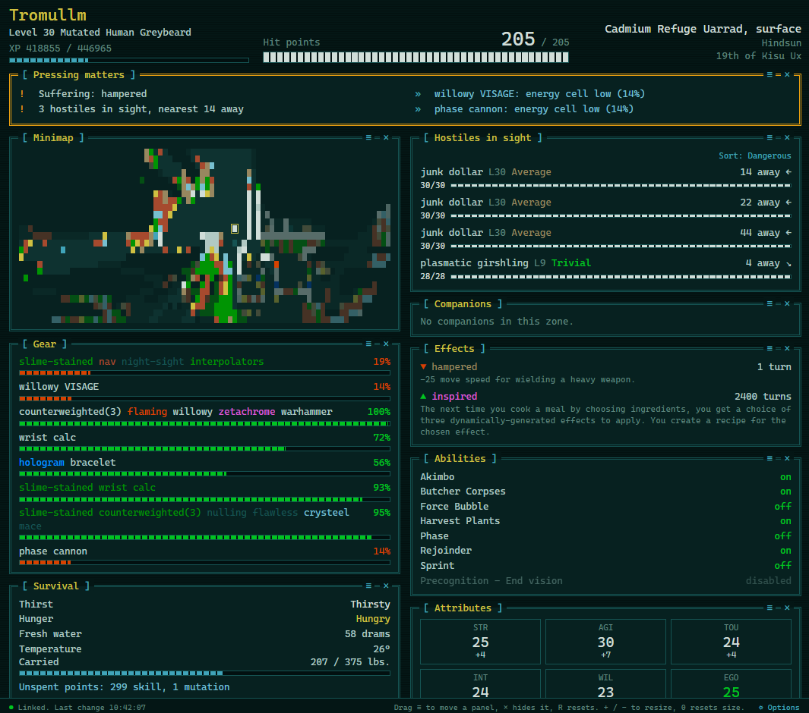

# Qud HUD

A second monitor heads-up display for [Caves of Qud](https://www.cavesofqud.com/).

Your character's state is written out every turn and drawn as a page you keep open on another
screen: hit points, what's wrong with you, what's hunting you, what's on cooldown, and what needs
attention right now, without pausing to dig through sub-screens.



## Install

**From Steam:** subscribe to the [Workshop item](https://steamcommunity.com/sharedfiles/filedetails/?id=3805872225).

**Without Steam:** download `QudHUD-vX.Y.Z.zip` from [Releases](https://github.com/virtualbeck/qud-hud/releases)
and extract the `QudHUD` folder into your Caves of Qud `Mods` folder:

| | |
|---|---|
| Windows | `%USERPROFILE%\AppData\LocalLow\Freehold Games\CavesOfQud\Mods` |
| macOS | `~/Library/Application Support/com.FreeholdGames.CavesOfQud/Mods` |
| Linux | `~/.config/unity3d/Freehold Games/CavesOfQud/Mods` |

Either way: enable it in the Mods menu, start or load a game, and the message log will tell you
where the display page was written, normally `Documents/QudHUD/hud.html`. Open that in a browser
on your second monitor.

Nothing is sent anywhere. The page reads a local file the mod writes; no server, no network.

## Use

Full instructions are in [mod/README.md](mod/README.md), which ships with the mod. In short:

- Drag a panel by its `≡` grip to rearrange it, or focus the grip and use the arrow keys.
- `×` hides a panel; **Options** in the footer brings it back.
- `+` / `-` resize, `0` resets, `R` restores the default layout and unhides every panel.
- **Hostiles in sight** has a Sort toggle: nearest first, or most dangerous first.
- **Companions** shows your followers, by the same rules as hostiles.
- **Minimap**, **Nearby objects** and **Messages** mirror the three windows the game docks together,
  showing only what your character knows.
- Unspent point reminders in **Pressing matters** can be dismissed with the `×` beside them, until
  the number changes.
- **Options** can also hide abilities that are simply ready.
- The dot in the footer is green while the data is current, amber once nothing has been written for
  a couple of minutes, and red if the file can't be read. The readings fade when they go stale, so a
  closed game doesn't look like a live one.

## Bugs and suggestions

Please open an [issue](https://github.com/virtualbeck/qud-hud/issues). Useful things to include:
the mod version (shown in **Options** on the page), your game version, and any lines starting with
`[QudHUD]` in `Player.log`.

If a panel stops drawing after a game update, the footer will name it and the browser console will
have the error. That text is the most useful thing you can paste into an issue.

## Building from source

Requires Python 3.8+. No other dependencies.

```
python build.py              # dist/QudHUD and dist/QudHUD-vX.Y.Z.zip
python build.py --install    # also copy it into your Mods folder
python build.py --uninstall  # remove that copy again
python build.py --check      # compile the mod against your installed game first
```

`--check` finds the game through Steam and compiles the built mod against the game's own DLLs,
reporting errors by line in `src/QudHUD.template.cs`, so a mistake fails in seconds rather than when
the game loads. On Windows it uses the .NET Framework compiler that every install already has.
`python build.py --check --install` installs only what compiles.

Most of what the mod reads from the game it reaches by reflection, which cannot fail to compile but
can quietly find nothing. So `--check` also compiles `tests/probe/GameApi.cs`, one line per member
the mod relies on that way, and reports which of them this build of the game actually has.

`src/hud.html` is the display page and can be opened directly in a browser to work on the design.
It shows a waiting screen until a `hud_data.js` sits next to it.

One gotcha worth knowing: a locally installed copy and a Workshop-subscribed copy share the same mod
ID, and having both present can make the game load a mix of the two. Unsubscribe or `--uninstall`
while working on it.

## Tests

Needs Node and Python.

```
cd tests
npm install
npm test
```

This runs the display page in jsdom against a synthetic `hud_data.js`, the page's periodic rebuild,
and `build.py` and everything it produces, including the Workshop build file.

When a C# compiler is available (the .NET SDK, or on Windows the .NET Framework one) the tests also
compile the mod, hold it to C# 5 so `--check` keeps working with the Windows built-in compiler, and
run parts of it against stand-ins for the game in `tests/stubs`. Those stand-ins mirror how the mod
uses the game rather than the game itself, so they prove the mod's own code, not that the game's API
still matches; `--check` is what tests that. Without a compiler those tests are skipped.

## Layout

| | |
|---|---|
| `src/QudHUD.template.cs` | the mod. `__HTML__` and `__VERSION__` are filled in by the build |
| `src/hud.html` | the display page |
| `mod/` | files shipped as-is: manifest, preview, player README, Workshop link |
| `VERSION` | the single source of the version number |
| `build.py` | builds, installs, and can publish to the Workshop via SteamCMD (`--workshop`) |

## License

MIT, see [LICENSE](LICENSE).
